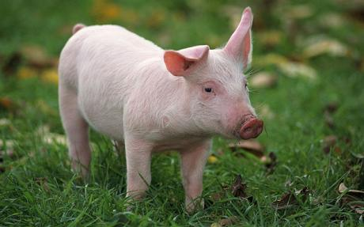
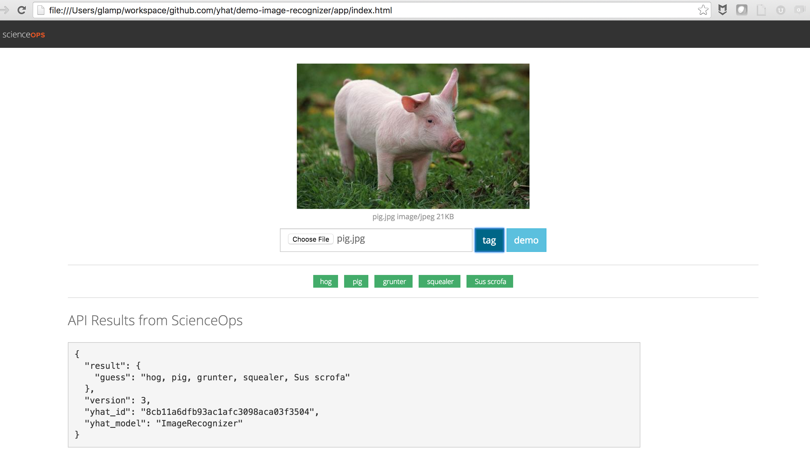

# demo-image-recognizer
ScienceOps demo for image classification using Keras, Tensorflow, and OpenCV.

Model is here: [`image-recognizer.ipynb`](./image-recognizer.ipynb).

Application is here: https://github.com/yhat/ops-photo-tagger-web

